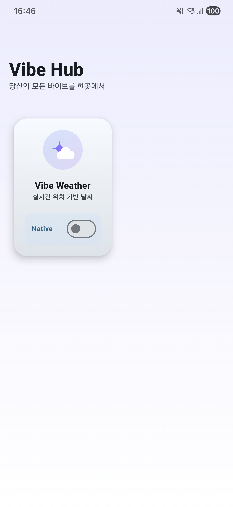
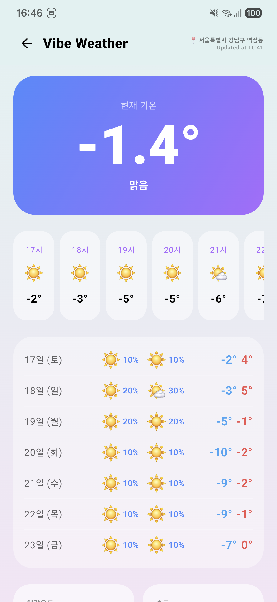
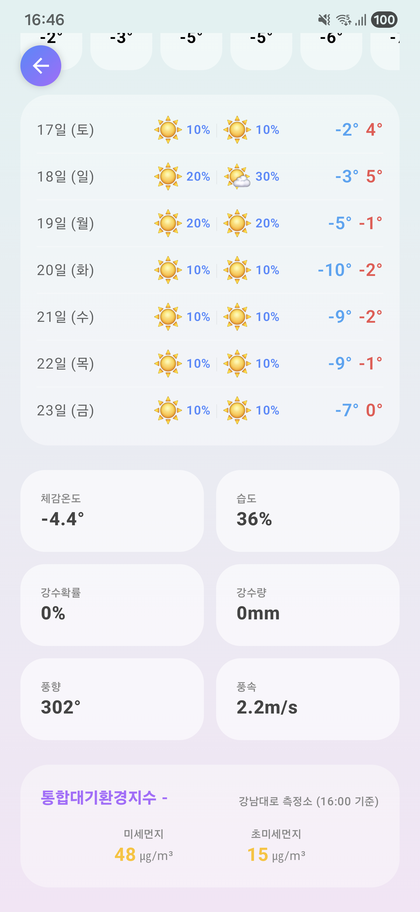

# VibeHub: 당신의 모든 바이브를 하나로 연결하다

**VibeHub**는 바이브 코딩 프로젝트의 모든 서비스를 하나로 연결하는 중심(Hub)입니다. 
웹, 모바일, 서버 등 다양한 형태로 흩어져 있는 바이브 서비스들을 하나의 네이티브 앱 환경에서 매끄럽게 경험할 수 있도록 설계되었습니다.

**이 프로젝트는 바이브 코딩 프로젝트의 두 번째 여정이며, 제미나이 CLI(Gemini CLI)를 이용한 100% 바이브 코딩으로만 제작되었습니다.**

---

## 📸 Screenshots

<p align="center">
  
  
  
</p>

---

## ✨ 주요 기능

*   **🧩 모듈형 허브 구조**: 
    *   새로운 서비스가 추가될 때마다 독립적인 모듈(:feature)로 쉽게 확장 가능한 유연한 아키텍처.
    *   네이티브 기능과 웹뷰(WebView)를 자유롭게 오가는 하이브리드 환경 제공.

*   **⛅ Vibe Weather (통합 날씨 서비스)**: 
    *   **📍 초정밀 실시간 날씨**: 기상청 3종 API(실황/초단기/단기)를 서버에서 융합하여 가장 정확한 현재 날씨 제공.
    *   **🎨 럭셔리 & 미니멀 UI**: 불필요한 요소를 제거하고 카드 중심의 직관적인 디자인과 부드러운 애니메이션 구현.
    *   **⚡ 스마트 캐싱**: 화면을 이동해도 데이터가 즉시 로드되며, Pull-to-Refresh 시에만 데이터를 갱신하는 효율적인 로직.
    *   **📅 상세 예보**: 시간별(24시간+), 일자별(10일간), 대기질(미세/초미세) 정보를 한눈에 확인.

---

## 🛠️ 기술 스택 (Tech Stack)

*   **Language**: Kotlin 100%
*   **UI Framework**: Jetpack Compose (Material3)
*   **Architecture**: MVVM, Clean Architecture, Multi-module (:app, :feature:weather, :core:*)
*   **Dependency Injection**: Hilt
*   **Network**: Retrofit2, OkHttp3 (Coroutines & Flow)
*   **Asynchronous**: Kotlin Coroutines & Flow

---

## 🚀 시작하기

### **1. 요구 사항**
*   Android Studio Ladybug 이상
*   JDK 17 이상
*   **Vibe Weather 서버 구동 필요**: 이 앱은 `vibe-weather` 백엔드 서버와 연동되어 작동합니다.

### **2. 설정**
로컬 환경에서 테스트하려면 `core/network/src/main/java/com/vibe/hub/core/network/di/NetworkModule.kt`의 `BASE_URL`을 본인의 서버 주소(예: `http://10.0.2.2:8080/`)로 변경해야 할 수 있습니다.

### **3. 빌드 및 실행**
```bash
git clone https://github.com/Park-minsung-je/Vibe-Hub.git
./gradlew assembleDebug
```

---

## 📝 License
Copyright © 2026 VibeHub. All rights reserved.
